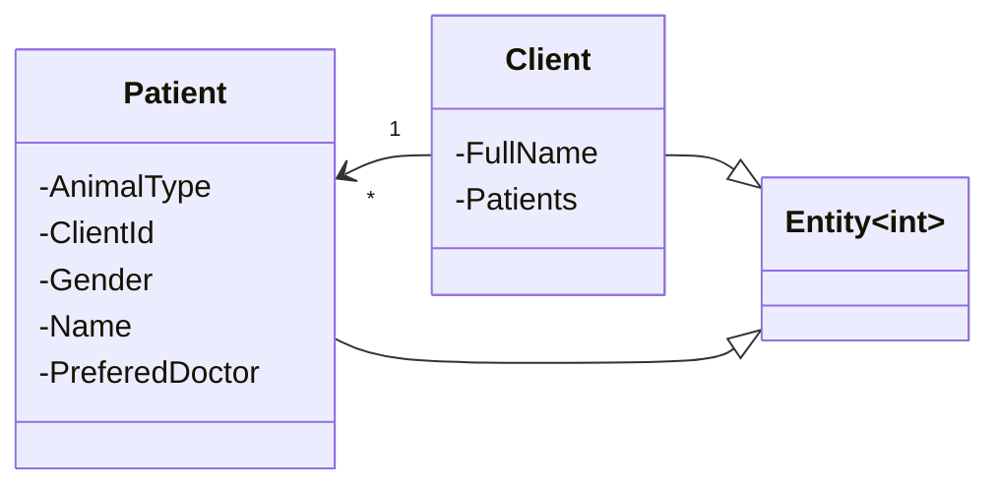
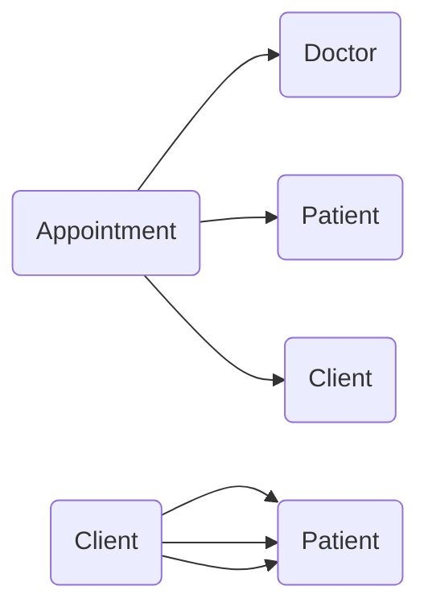
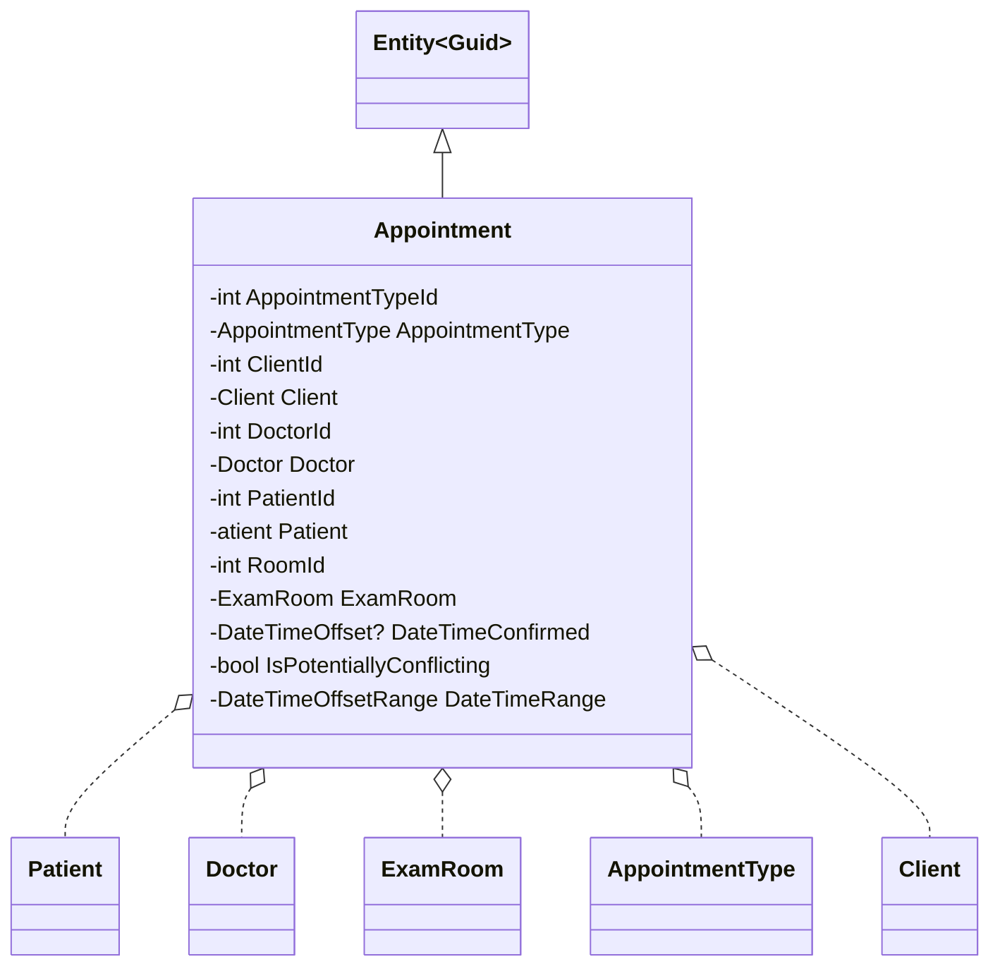
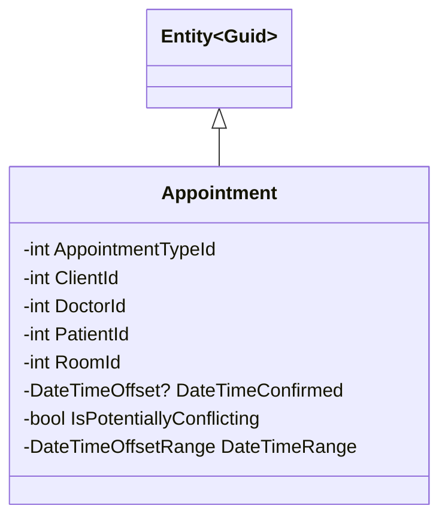
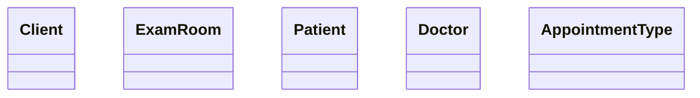
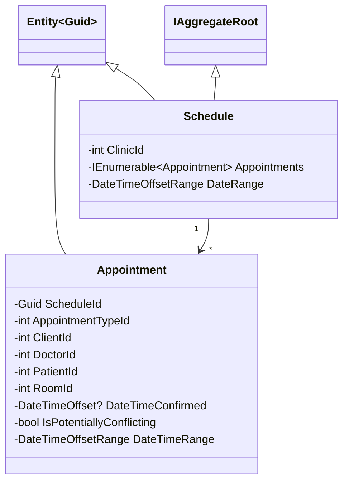

# Applying Aggregates and Associations

## Tackling Data Complexity

Large systems often lead to complex data models. One way to reduce the data complexity is to use **Aggregates** and **Aggregate Roots**. Another is limiting how many bi-directional relationships you have in a data model. If your design does not have any clear notion of **Aggregates**, the dependencies between your entities may grow out of control resulting in a model like this one.


And if your object model reflects the data model like this one trying to populate all of the dependent objects of one object may result in trying to load the entire database in memory. And the same problem exists when it is time to save changes. With a model like this, there is no limit to which areas of the data model might be affected.


## Introducing Aggregates and Aggregate Roots

**Aggregates** consist of one or more **Entities** and **ValueObjects** that change together. We need to treat them as a unit for data changes and consider the entire **Aggregates** consistency before we apply changes.

An example may be an order and its items. These will be separate objects, but treating the order (together with its items) as a single **Aggregate** is helpful. 

Every **Aggregate** must have an **Aggregate Root** which is the parent object of all members of the **Aggregate**. It's possible to have an **Aggregate** that consists of just one object, in which case that object will still be the **Aggregate Root**. 

The **Aggregate** can have rules that enforce data consistency that apply across multiple objects. Any references from outside the aggregate should only go to the **Aggregate Root**. The **Aggregate Root** can thus ensure the integrity of the **Aggregate** as a whole.

**Aggregates** are the basic element of transfer of data storage - you request to load or save whole **Aggregates**. Transactions should not cross **Aggregate** boundaries. Data Changes To The **Aggregate** Should Follow ACID (Atomic, Consistent, Isolated, Durable).

**Aggregate Root** is responsible for maintaining its **Invariants**, such as the required number and types of components. An **Invariant** is a condition that should always be true for the system to be in a consistent state.

When considering whether a particular object should be treated as an **Aggregate Root**, you should think about whether deleting it should cascade. In other words, you also need to delete the other objects in its aggregate hierarchy. If so, the object in question should be considered an **Aggregate Root**.

> An aggregate is a cluster of associated objects that we treat as a unit for the purpose of data changes.

Eric Evans

**Aggregates** are sometimes confused with collection classes (lists, maps, etc). **Aggregates** are domain concepts (order, clinic visit, playlist), while collections are generic. An **Aggregate** will often contain mutliple collections, together with simple fields. The term **Aggregate** is a common one, and is used in various different contexts (e.g. UML), in which case it does not refer to the same concept as a DDD **Aggregate**.

## Considering Associations in Aggregates

Default to one-way associations. Bi-directional relationships should be used only when neither object can be defined without the other if that is not the case, you need to be specific about the direction of the relationship. Also called the traversal direction. 

> A bidirectional association means that both objects can be understood only together. When application requirements do not call for traversal in both directions, adding a traversal direction reduces interdependence and simplifies the design.

Eric Evans

The One-Way Client -> Patient Relationship in the Scheduling Bounded Context



Navigation Property - Property that allows navigation from one end of an association to another. A navigation property does not carry data, but acts as a pointer.

Uni-Directional Associations in the Scheduling Bounded Context



## Handling Relationships that Span Aggregates

**Aggregates** serve as boundaries between logical groupings within an application. We enforce these boundaries by prohibiting direct references to objects within the **Aggregates** that aren't the **Aggregate root**.


**Object relationships are not the same as relationships between persisted data.**

The downside of Bi-Directional Navigation (with ORM) - If you are to save an **Address** that has a **Customer** object attached to the **Customer** property, there are scenarios in which EF (Entity Framework) will also update the **Customer**. In other words, updating the **Address** also causes the ORM (EF) to update the **Customer**. This behavior leads to a lot of confusion.


## Evolving the Appointments Aggregate




By simply including the IDs of related concepts rather than object references, we can ensure that creating and changing **Appointments** has a minimal impact on our system when we persist the **Appointment** (**Appointments** won't affect **Clients**, **Patients**, etc.). This relationship works because an **Appointment** in the real world is just a note that includes a place, time, and additional details. Adding and removing **Appointments** shouldn't impact the people and places involved. And this revised design reflects this.



---------------------------------------------------------------------
***<p align="center">Maintained in other bounded contexts</p>***



## Using Invariants to Better Understand our Aggregate

**Aggregate root** is responsible for maintaining the rules of the **Aggregate**. It's the **Aggregate root** responsibility to verify any **Invariants** that **Aggregate** may have. And in this case, the **Appointment** is still acting as an **Aggregate root**, even if we eliminate the navigation properties to the other objects that it may be working with.

**Invariant** - A condition that should always be true for the system to be in a consistent state.

**Invariant**: Two appointments do not overlap one another. How does one **Appointment** know whether it overlaps another? **Appointment** doesn't make sense as **Aggregate root** if you apply this thinking to the Appointment Scheduling Bounded Context. Appointments don't know about each other, but the **Scheduler** knows about such things. 

Cross-aggregate invariants should not be enforced by any one aggregate. In case of something like a unique constraint between all **Aggregates**, you might need to use **Domain Service** or another approach. However, in other cases, the need to do this may indicate that you've missed an important part of your model.

In this case, the whole thing that the user is interacting with is the clinic **Schedule**, but nothing in our original model referred to the **Schedule** itself. Since some of our business rules, like what to do with **Appointments**, that conflict only makes sense on this higher level. It makes sense to introduce a change to our model - the **Schedule Aggregate**.

It’s normal and expected for models to evolve as you learn more about the domain. 

> Each refinement of code and model gives developers a clearer view. This clarity often creates the potential for a breakthrough of insights.

Eric Evans

## Schedule Aggregate

- Enforces invariants
- Saving changes can save entire aggregate
- Cascading delete is okay

**Schedule Aggregate** inherits from a common **BaseEntity\<Guid\>** type and uses **Guid** for its key just like **Appointment**. This lets us set keys ourselves rather than relying on a database to do it for us. The class also implements the **IAggregateRoot** interface.

Its constructor takes its id, date range, and associated clinic id. The constructor is responsible for ensuring that incoming values are valid and always created in a consistent state. 

**Schedule** has just a few properties there is the **ClinicId**, the associate set of **Appointments** and the **DateRange**. We are careful only to expose a read-only `IEnumerable<Appointment> Appointments` because our **Aggregate** must encapsulate its internal state. 

We don't want other parts of our application to add or delete **Appointments** without going through **Schedule**'s explicit methods designed for this purpose. 

The **DateRange** isn't persisted since it can vary with any given instantiation of the **Schedule**.
	
The actual population of the **Appointments** that match this range is the responsibility of the **Specification** and **Repository** classes used to retrieve the **Schedule** from the database.

The configuration of the **Aggregate** persistent details are done in the **Infrastructure** project `/Data/Config` folder. This is where **Entities** **EF Core** specific mappings and configurations are performed, which keeps these details out of our **Domain Model**.

Let's look at the `AddNewAppointment` method. The method validates the input to ensure that we don't add bad data to **Aggregate**. And then adds the appointment. When the **Appointment** is added, the **Schedule** is responsible for marking any **Appointments** that may be conflicted. `MarkConflictingAppointments();` After marking any conflicts, an `AppointmentScheduledEvent` is added to the **Aggregates** event collection.

```csharp
    public void AddNewAppointment(Appointment appointment)
    {
	Guard.Against.Null(appointment, nameof(appointment));
	Guard.Against.Default(appointment.Id, nameof(appointment.Id));
	Guard.Against.DuplicateAppointment(_appointments, appointment, nameof(appointment));

	_appointments.Add(appointment);

	MarkConflictingAppointments();

	var appointmentScheduledEvent = new AppointmentScheduledEvent(appointment);
	Events.Add(appointmentScheduledEvent);
    }
```

The `DeleteAppointment` method is similar. After deleting an **Appointment**, the **Schedule** needs to once more mark any **Appointment** that may be conflicting `MarkConflictingAppointments();`.

Marking conflicting appointments (`MarkConflictingAppointments` method) is an important part of the business logic for this application and is encapsulated right in the **Schedule Aggregate**.

The `AppointmentUpdatedHandler` method provides a hook for its **Appointments** to use to notify it when changes are made to one of them. Because we do not have navigation properties from **Appointments** back to **Schedule**, we can't directly call methods on the **Aggregate Root** from the **Appointment** method.



```csharp
public class Schedule : BaseEntity<Guid>, IAggregateRoot
{
    private readonly List<Appointment> _appointments = new List<Appointment>();

    public Schedule(
	Guid id,
	DateTimeOffsetRange dateRange,
	int clinicId)
    {
	Id = Guard.Against.Default(id, nameof(id));
	DateRange = dateRange;
	ClinicId = Guard.Against.NegativeOrZero(clinicId, nameof(clinicId));
    }

    private Schedule(Guid id, int clinicId) // used by EF
    {
	Id = id;
	ClinicId = clinicId;
    }

    public int ClinicId { get; private set; }

    public IEnumerable<Appointment> Appointments => _appointments.AsReadOnly();

    public DateTimeOffsetRange DateRange { get; private set; }

    public void AddNewAppointment(Appointment appointment)
    {
	Guard.Against.Null(appointment, nameof(appointment));
	Guard.Against.Default(appointment.Id, nameof(appointment.Id));
	Guard.Against.DuplicateAppointment(_appointments, appointment, nameof(appointment));

	_appointments.Add(appointment);

	MarkConflictingAppointments();

	var appointmentScheduledEvent = new AppointmentScheduledEvent(appointment);
	Events.Add(appointmentScheduledEvent);
    }

    public void DeleteAppointment(Appointment appointment)
    {
	Guard.Against.Null(appointment, nameof(appointment));
	var appointmentToDelete = _appointments
			.Where(a => a.Id == appointment.Id)
			.FirstOrDefault();

	if (appointmentToDelete != null)
	{
		_appointments.Remove(appointmentToDelete);
	}

	MarkConflictingAppointments();

	// TODO: Add appointment deleted event and show delete message in Blazor client app
    }

    private void MarkConflictingAppointments()
    {
	foreach (var appointment in _appointments)
	{
	    // same patient cannot have two appointments at same time
	    var potentiallyConflictingAppointments = _appointments
		.Where(a => a.PatientId == appointment.PatientId &&
		a.TimeRange.Overlaps(appointment.TimeRange) &&
		a != appointment)
		.ToList();

	    // TODO: Add a rule to mark overlapping appointments in same room as conflicting
	    // TODO: Add a rule to mark same doctor with overlapping appointments as conflicting

	    potentiallyConflictingAppointments.ForEach(a => a.IsPotentiallyConflicting = true);

	    appointment.IsPotentiallyConflicting = potentiallyConflictingAppointments.Any();
	}
    }

    /// <summary>
    /// Call any time this schedule's appointments are updated directly
    /// </summary>
    public void AppointmentUpdatedHandler()
    {
	// TODO: Add ScheduleHandler calls to UpdateDoctor, UpdateRoom to complete additional rules described in MarkConflictingAppointments
	MarkConflictingAppointments();
    }
}
```

## Aggregate Tips

- Break the model up into aggregates
- Aggregates encapsulate business rules and invariants.
- Default to one-way relationships when modeling associations.
- Aggregates are not always the answer.
- Aggregates can connect only by the root.
- Don’t overlook using FKs for non-root entities.
- Too many FKs to non-root entities may suggest a problem.
- “Aggregates of one” are acceptable.
- “Rule of Cascading Deletes”.
- Don’t fear evolving the design of your aggregates as you learn more about the domain.


## Key Terms from this Module

- **Aggregate** - A transactional graph of objects (graph of objects in a transaction).
- **Aggregate Root** - The entry point of an aggregate which ensures the integrity of the entire graph.
- **Invariant** - A condition that should always be true for the system to be in a consistent state.
- **Associations** - The modeled relationship between entities.
- **Navigation Properties** - An ORM term to describe properties that reference related objects.
- **Unidirectional Relationships** - Associations between two entities that can only be navigated in one direction.


