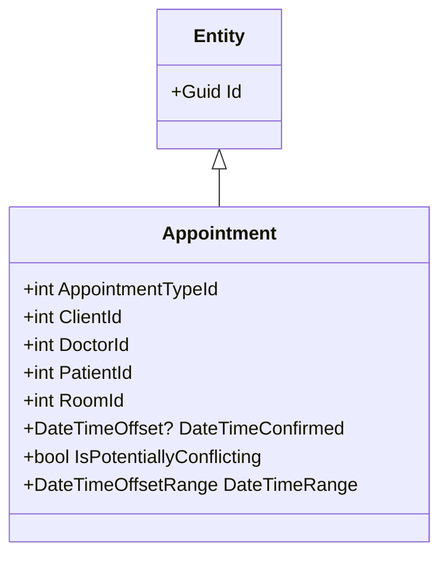
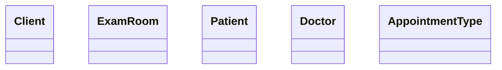

# Applying Aggregates and Associations

## Tackling Data Complexity

Large systems often lead to complex data models. One way to reduce the data complexity is to use **Aggregates** and **Aggregate Roots**. Another is limiting how many bi-directional relationships you have in a data model. If your design does not have any clear notion of **Aggregates**, the dependencies between your entities may grow out of control resulting in a model like this one.

And if your object model reflects the data model like this one trying to populate all of the dependent objects of one object may result in trying to load the entire database in memory. And the same problem exists when it is time to save changes. With a model like this, there is no limit to which areas of the data model might be affected.

## Introducing Aggregates and Aggregate Roots

**Aggregates** consist of one or more **Entities** and **ValueObjects** that change together. We need to treat them as a unit for data changes and consider the entire **Aggregates** consistency before we apply changes.

An example may be an order and its items. These will be separate objects, but treating the order (together with its items) as a single **Aggregate** is helpful. 

Every **Aggregate** must have an **Aggregate Root** which is the parent object of all members of the **Aggregate**. It's possible to have an **Aggregate** that consists of just one object, in which case that object will still be the **Aggregate Root**. 

The **Aggregate** can have rules that enforce data consistency that apply across multiple objects. Any references from outside the aggregate should only go to the **Aggregate Root**. The **Aggregate Root** can thus ensure the integrity of the **Aggregate** as a whole.

**Aggregates** are the basic element of transfer of data storage - you request to load or save whole **Aggregates**. Transactions should not cross **Aggregate** boundaries. Data Changes To The **Aggregate** Should Follow ACID (Atomic, Consistent, Isolated, Durable).

**Aggregate Root** is responsible for maintaining its **Invariants**, such as the required number and types of components. An **Invariant** is a condition that should always be true for the system to be in a consistent state.

When considering whether a particular object should be treated as an **Aggregate Root**, you should think about whether deleting it should cascade. In other words, you also need to delete the other objects in its aggregate hierarchy. If so, the object in question should be considered an **Aggregate Root**.

> An aggregate is a cluster of associated objects that we treat as a unit for the purpose of data changes.

Eric Evans

**Aggregates** are sometimes confused with collection classes (lists, maps, etc). **Aggregates** are domain concepts (order, clinic visit, playlist), while collections are generic. An **Aggregate** will often contain mutliple collections, together with simple fields. The term **Aggregate** is a common one, and is used in various different contexts (e.g. UML), in which case it does not refer to the same concept as a DDD **Aggregate**.

## Considering Associations in Aggregates

Default to one-way associations. Bi-directional relationships should be used only when neither object can be defined without the other if that is not the case, you need to be specific about the direction of the relationship. Also called the traversal direction. 

> A bidirectional association means that both objects can be understood only together. When application requirements do not call for traversal in both directions, adding a traversal direction reduces interdependence and simplifies the design.

Eric Evans

The One-Way Client -> Patient Relationship in the Scheduling Bounded Context

Navigation Property - Property that allows navigation from one end of an association to another. A navigation property does not carry data, but acts as a pointer.

Uni-Directional Associations in the Scheduling Bounded Context

## Handling Relationships that Span Aggregates

**Aggregates** serve as boundaries between logical groupings within an application. We enforce these boundaries by prohibiting direct references to objects within the **Aggregates** that aren't the **Aggregate root**.

**Object relationships are not the same as relationships between persisted data.**

The downside of Bi-Directional Navigation (with ORM) - If you are to save an **Address** that has a **Customer** object attached to the **Customer** property, there are scenarios in which EF (Entity Framework) will also update the **Customer**. In other words, updating the **Address** also causes the ORM (EF) to update the **Customer**. This behavior leads to a lot of confusion.

## Evolving the Appointments Aggregate

By simply including the IDs of related concepts rather than object references, we can ensure that creating and changing **Appointments** has a minimal impact on our system when we persist the **Appointment** (**Appointments** won't affect **Clients**, **Patients**, etc.). This relationship works because an **Appointment** in the real world is just a note that includes a place, time, and additional details. Adding and removing **Appointments** shouldn't impact the people and places involved. And this revised design reflects this.

---------------------------------------------------------------------
***
Maintained in other bounded contexts
***

## Using Invariants to Better Understand our Aggregate

**Aggregate root** is responsible for maintaining the rules of the **Aggregate**. It's the **Aggregate root** responsibility to verify any **Invariants** that **Aggregate** may have. And in this case, the **Appointment** is still acting as an **Aggregate root**, even if we eliminate the navigation properties to the other objects that it may be working with.
