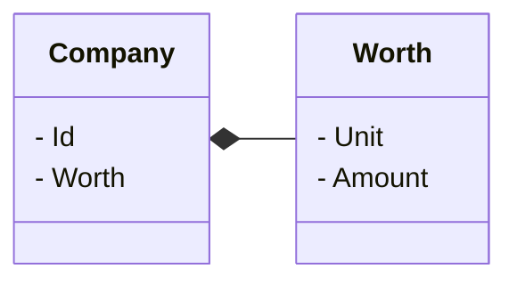
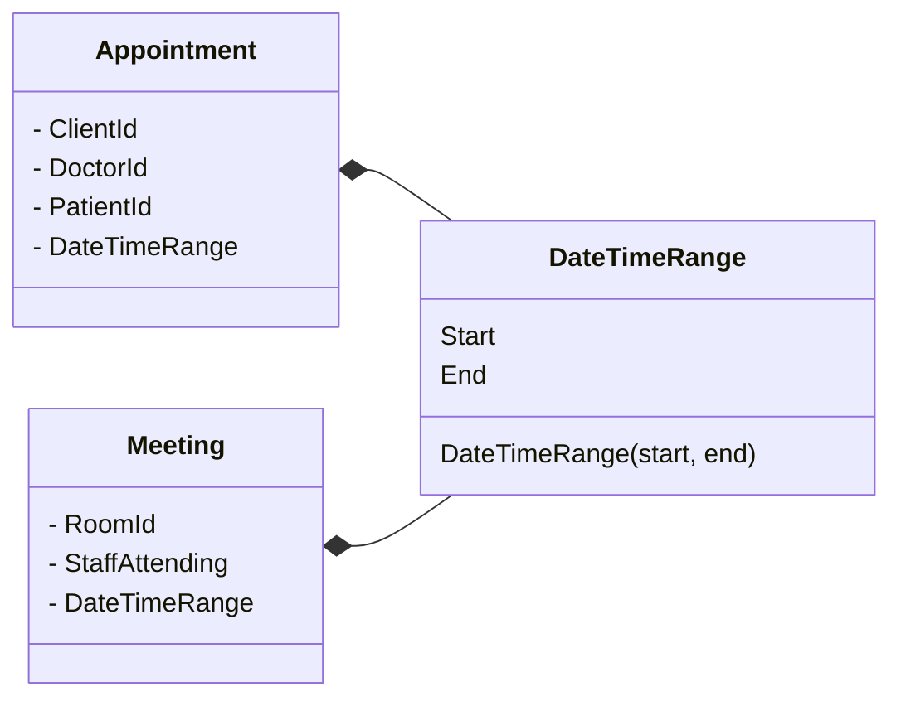

# Elements of a Domain Model: Value Objects & Services

**Value Objects** are objects defined **by their value**, **not by identity**. Measures quantify or describe a thing in the domain. Its identity is based on the composition of values of all of its properties. Because the properties define the **Value Object**, it should be immutable (i.e., you shouldn't be able to change any of its properties once you create one of these objects. Instead, you create another instance with the new values). 

If you need to compare two **Value Objects** to determine if they are equal, you should do so by comparing all the values. Value objects may have methods and behavior, but they should never have side effects. Any method on the **Value Objects** should compute things. They should never change the state of the **Value Objects**. New **Value Objects** should be returned if a new value is needed.

Make sure to distinguish the **Value Objects** pattern from C# support for value and reference types. Custom **ValueTypes** are defined with structs, and **Reference Types** are defined with classes. In **DDD**, both **DDD Entities** and **DDD Value Objects** are defined as classes.

## Recognizing Commonly Used Value Objects

- **String** is a **Value Object**.
  - String Methods Respect Immutability
    - Replace (StringA, StringB) - Returns a new string in which all occurrences StringA in the current instance are replaced with StringB.
    - ToUpper() - Returns a copy of this string converted to uppercase.
    - ToLower() - Returns a copy of this string converted to lowercase.
- Money is a Great candidate for a **Value Object**. 
- Dates are a classic value object, and they have all kinds of logic.

### [Whole Value](http://fit.c2.com/wiki.cgi?WholeValue).

A whole value is a quantity used to describe things in a domain. Whole values are not themselves things, but measures of things. As such they do not have an identity of consequence.

For example, we might say a company is worth 50,000,000 dollars. Some thing, the company, its stock, or a proposed investment, is being measured. The thing is a real object while the 50,000,000 dollars is a value, a property of the thing.

In object oriented computing it is commonplace and good practice to model values as objects. Key to this is defining a notion of equality that is independent of object identity. Another key, and the point of the WholeValue pattern, is that the objects model the whole property being measured, not just some part of it. In the example above the whole value is 50,000,000 dollars, not just 50,000,000 and not just "dollars".

If I know a field will contain a whole value or nil, I do not have to be concerned with any conditions outside those modeled by the whole value once I have established that it is not nil. The whole value pattern argues that whole values should be entered in single fields and checked to be well formed in one place.

Worth is a **Value Object**



GeoCoordinate are another example of whole value.

DateTimeRange as **Value Object**.



> It may surprise you to learn that we should strive to model using Value Objects instead of Entities wherever possible. Even when a domain concept must be modeled as an Entity, the Entity’s design should be biased toward serving as a value container rather than a child Entity container.

Vaughn Vernon – Implementing Domain Driven Design


## When Considering Domain Objects

Our Instinct:
  1. Probably an entity
  2. Maybe a value object

Vaughn Vernon’s guidance:
  1. Is this a value object?
  2. Otherwise, an entity

Value Objects Can Be Used for Identifiers 

`ClientIdValueObject.cs`

```csharp
public class ClientId
{
    public ClientId()
    {
        Id = Guid.NewGuid();
    }
  
    public ClientId(Guid id)
    {
        Id = id;
    }
  
    public Guid Id { get; private set; }
  
    [Equality and Hash override code]
}
```

Value Objects Can Be Used for Identifiers

`Client.cs`

```csharp
public class Client
{
    public ClientIdValueObject Id {get; set;}
}

// or

public class Client : BaseEntity<ClientIdValueObject>
{
    // Id property provided by base type
}
```


Explicit ID Value Objects Instead of Ints/GUIDs - Helps to Avoid Errors in Passed Parameters

`Client.cs`

```csharp
public class Client : BaseEntity<ClientIdValueObject>
{
    . . .
}
```

`SomeService.cs`

```csharp
public class SomeService
{
    public void CreateAppointmentFor(
        ClientIdValueObject clientId,
        PatientIdValueObject patientId)
    {
        . . .
    }
}
```

> I think that value objects are a really good place to put methods and logic…because we can do our reasoning without side effects and identity, all those things that make logic tricky. We can put functions on those value objects and do the pure reasoning there.

Eric Evans


## Implementing Value Objects in Code

- The state of a value object should not be changed once it has been created.
- Generic logic makes sense in value objects.
- It’s easier to test logic that’s in a value object.
- Entity becomes an orchestrator.


> A higher level of abstraction in entities can lead you to a more precise ubiquitous language.

Eric Evans

```DateTimeRange.cs```

```csharp
public class DateTimeRange : ValueObject
{   
    public DateTimeRange(DateTime start, DateTime end)
    {
        // Ardalis.GuardClauses supports extensions with custom guards per project
        Guard.Against.OutOfRange(start, nameof(start), start, end);
        Start = start;
        End = end;
    }

    public DateTimeRange(DateTime start, TimeSpan duration)
        : this(start, start.Add(duration))
    {
    }
    
    public DateTime Start { get; private set; }
    
    public DateTime End { get; private set; }
    
    public DateTimeRange NewEnd(DateTime newEnd)
    {
        return new DateTimeRange(this.Start, newEnd);
    }
    
    public bool Overlaps(DateTimeRange dateTimeRange)
    {
        return this.Start < dateTimeRange.End && this.End > dateTimeRange.Start;
    }
    
    // used by base ValueObject type to implement equality
    protected override IEnumerable<object> GetEqualityComponents()
    {
        yield return Start;
        yield return End;
    }
}
```

`AnimalType.cs`

```csharp
public class AnimalType : ValueObject
{   
    public AnimalType(string species, string breed)
    {
        Species = species;
        Breed = breed;
    }
    
    public string Species { get; private set; }
    public string Breed { get; private set; }
    
    // used by base ValueObject type to implement equality
    protected override IEnumerable<object> GetEqualityComponents()
    {
        yield return Breed;
        yield return Species;
    }
}
```

## Understanding Domain Services

A **Domain Service** is often appropriate when an operation is important to the model but doesn't necessarily belong to any **Entity** or **ValueObject**. But take your time finding a natural home for the operation of an existing entity or value object. Or you may end up with a very procedural anemic model.

Frequently **Domain Services** serve as orchestrators for operations that require several different collaborating **Entities** or **ValueObjects**.
  - Not a natural part of an entity or value object.
  - Has an interface defined in terms of other domain model elements.
  - Stateless, but may have side effects.
  - Lives in the core of the application.


### Examples of Services in Different Layers

- Infrastructure Layer
  - Send Email
  - Log to a File
- UI and App Layer
  - Message Sending
  - Message Processing
  - XML Parsing
  - UI Services
- Domain Layer
  - Orchestrating workflow
  - Transfer Between Accounts
  - Process Order


## Services in Domain-Driven Design (DDD)

### Domain Services - part of the domain layer

> When a **significant process or transformation** in the domain is **not** a natural **responsibility** of an **ENTITY** or **VALUE OBJECT**, add an **operation** to the model as standalone interface declared as a **SERVICE**. Define the interface in terms of the **language of the model** and make sure the **operation name** is part of the **UBIQUITOUS LANGUAGE**. Make the SERVICE stateless.

Eric Evans

**Domain services** are often overlooked as key building blocks, overshadowed by focus on **entities** and **value objects**. On the other end of the spectrum is **over-utilization** of **domain services** leading to an **anemic domain model** in what essentially becomes a **separation** of **data**, stored in entities, and **behaviors**, provided by the service. This can become an anti-pattern because the information expert aspect of OOP is lost.

**Domain services** are different from infrastructural services because they embed and operate upon domain concepts and are **part** **of** the **ubiquitous language**.


### Application service

An **application service** has an important and distinguishing role - it **provides a hosting environment for the execution of domain logic**. As such, it is a convenient point to **inject** various **gateways** such as a **repository** or **wrappers** for **external services**. 

**A common problem in applying DDD is when an entity requires access to data in a repository** or other gateway in order to carry out a business operation. One solution is to **inject repository dependencies directly** into the entity, however this is often **frowned upon**. One reason for this is because it requires the plain-old-(C#, Java, etc…) objects implementing entities to be part of an **application dependency graph**. Another reason is that is makes reasoning about the behavior of entities more difficult since the **Single-Responsibility Principle is violated**. **A better solution is to have an application service retrieve the information required by an entity, effectively setting up the execution environment, and provide it to the entity.**

In addition to **being a host**, the purpose of an **application service** is to **expose** the **functionality** of the domain to other application layers as an **API**. This attributes an **encapsulating** role to the **service** - the service is an instance of the **facade pattern**. Exposing objects directly can be cumbersome and lead to leaky abstractions especially if interactions are distributed in nature. In this way, an application **service** also fulfills a translation role - that of **translating between external commands and the underlying domain object model**. The importance of this translation must not be neglected.

For example, a human requested command can be something like “transfer $5 from account A to account B”. There are a number of steps required for a computer to fulfill that command and we would never expect a human to issue a more specific command such as “load an account entity with id A from account repository, load an account entity with id B from account repository, call the debit method on the account A entity…”. This is a job best suited for an application service.

### Infrastructural services

**Infrastructural services** are **focused** encapsulating the “plumbing” requirements of an application; **usually IO concerns** such as file system access, database access, email, etc. 

For example, a common application requirement is the sending of an email notification informing interested parties about some event. The concept of the **event** **exists** in the **domain layer** and the **domain layer** **determines** when the **event** should be **raised**. An email **infrastructure service** can **handle** a **domain event** by generating and transmitting an appropriate email message.

Another infrastructural service can handle the same event and send a notification via SMS or other channel. The domain layer doesn’t care about the specifics or how an event notification is delivered, it only cares about raising the event.

A **repository** implementation is also an example of an **infrastructural service**. The **interface** is declared **in** the **domain layer** and is an important aspect of the domain. However, the specifics of the communication with durable storage mechanisms are handled in the infrastructure layer.


### Example application service from a purchase order domain

```csharp
// A repository.
public interface IPurchaseOrderRepository
{
    PurchaseOrder Get(string id);
}

// A markup interface for aggregate root
public interface IAggregateRoot
{  }

// A marker interface for a domain event.
public interface IDomainEvent { }

// Entity is responsible for adding events to event collection
public abstract class BaseEntity<TId>
{
    public List<IDomainEvent> Events = new List<IDomainEvent>();

    public TId Id { get; set; }
}

// The root entity of the PO aggregate - aggregate root.
public class PurchaseOrder : BaseEntity<Guid>, IAggregateRoot
{
    public Guid Id { get; private set; }
    public string VendorId { get; private set; }
    public string PONumber { get; private set; }
    public string Description { get; private set; }
    public decimal Total { get; private set; }
    public DateTime SubmissionDate { get; private set; }
    public ICollection<Invoice> Invoices { get; private set; }

    public decimal InvoiceTotal
    {
        get { return this.Invoices.Select(x => x.Amount).Sum(); }
    }

    public bool IsFullyInvoiced
    {
        get { return this.Total <= this.InvoiceTotal; }
    }

    bool ContainsInvoice(string vendorInvoiceNumber)
    {
        return this.Invoices.Any(x => x.VendorInvoiceNumber.Equals(vendorInvoiceNumber, StringComparison.OrdinalIgnoreCase));
    }

    public Invoice Invoice(IInvoiceNumberGenerator generator, string vendorInvoiceNumber, DateTime date, decimal amount)
    {
        // These guards maintain business integrity of the PO.
        if (this.IsFullyInvoiced)
            throw new Exception("The PO is fully invoiced.");
        if (ContainsInvoice(vendorInvoiceNumber))
            throw new Exception("Duplicate invoice!");

        var invoiceNumber = generator.GenerateInvoiceNumber(this.VendorId, vendorInvoiceNumber, date);

        var invoice = new Invoice(invoiceNumber, vendorInvoiceNumber, date, amount);
        this.Invoices.Add(invoice);
        
        // New Events are added to the Events collection.
        this.Events.Add(new PurchaseOrderInvoicedEvent(this.Id, invoice.InvoiceNumber));
        
        return invoice;
    }
}

// A domain event.
public class PurchaseOrderInvoicedEvent : IDomainEvent
{
    public PurchaseOrderInvoicedEvent(string purchaseOrderId, string invoiceNumber)
    {
        this.PurchaseOrderId = purchaseOrderId;
        this.InvoiceNumber = invoiceNumber;
    }

    public string PurchaseOrderId { get; private set; }
    public string InvoiceNumber { get; private set; }
}

// A value object. In production scenarios this would likely be an entity or even an aggregate.
public class Invoice
{
    public Invoice(string vendorInvoiceNumber, string invoiceNumber, DateTime date, decimal amount)
    {
        this.VendorInvoiceNumber = vendorInvoiceNumber;
        this.InvoiceNumber = invoiceNumber;
        this.InvoiceDate = date;
        this.Amount = amount;
    }

    // The invoice number provided by the vendor. 
    public string VendorInvoiceNumber { get; private set; }
    // The internal invoice number is used for internal lookups and is ensured to be unique and readable.
    public string InvoiceNumber { get; private set; }
    public DateTime InvoiceDate { get; private set; }
    public decimal Amount { get; private set; }
}


// A domain service used for generating unique and user-friendly invoice numbers.
public interface IInvoiceNumberGenerator
{
    string GenerateInvoiceNumber(string vendorId, string vendorInvoiceNumber, DateTime invoiceDate);
}

// The application service. Can either delegate to a domain model, as in this example, or a transaction script.
public class PurchaseOrderService
{
    public PurchaseOrderService(IPurchaseOrderRepository repository, IInvoiceNumberGenerator invoiceNumberGenerator)
    {
        this.repository = repository;
        this.invoiceNumberGenerator = invoiceNumberGenerator;
    }

    readonly IPurchaseOrderRepository repository;
    readonly IInvoiceNumberGenerator invoiceNumberGenerator;

    public void Invoice(string purchaseOrderId, string vendorInvoiceNumber, DateTime date, decimal amount)
    {
        var purchaseOrder = this.repository.Get(purchaseOrderId);

        if (purchaseOrder == null)
            throw new Exception("PO not found!");

        purchaseOrder.Invoice(this.invoiceNumberGenerator, vendorInvoiceNumber, date, amount);
    }
}

// Events are rised in AppDbContext
public class AppDbContext : DbContext
{
    ...
    // https://docs.microsoft.com/en-us/ef/core/logging-events-diagnostics/events
    public override async Task<int> SaveChangesAsync(CancellationToken cancellationToken = new CancellationToken())
    {
        ...
        var entitiesWithEvents = ChangeTracker
            .Entries()
            .Select(e => e.Entity as BaseEntity<Guid>)
            .Where(e => e?.Events != null && e.Events.Any())
            .ToArray();

        foreach (var entity in entitiesWithEvents)
        {
            var events = entity.Events.ToArray();
            entity.Events.Clear();

            foreach (var domainEvent in events)
            {
                // Using MediatR for rising and handling the events
                await _mediator.Publish(domainEvent, cancellationToken).ConfigureAwait(false);
            }
        }

        return result;
    }
    ...
}
```

The interface `IInvoiceNumberGenerator` is indeed a **domain service** because it encapsulates domain logic, namely the generation of invoice numbers. **This process is something that can be discussed with domain experts** and users of the system. After all, the purpose of the generator is to make use of invoice numbers of palatable.

By contrast, the `PurchaseOrderService` application service performs technical tasks which domain experts aren’t interested in.

The differences between a domain service and an application services are subtle but critical:

- **Domain services** are very **granular** where as **application services** are a **facade** purposed with providing an **API**.
- **Domain services** contain **domain logic** that can’t naturally be placed in an entity or value object whereas **application services** **orchestrate the execution of domain logic** and don’t themselves implement any domain logic.
- **Domain service** methods can have **other domain elements** as **operands** and **return values** whereas **application services** operate upon **trivial operands** such as **identity** values and **primitive data** structures.
- **Application services** declare **dependencies** on **infrastructural services** required **to execute domain logic**.
- **Command handlers** are a **flavor** of **application services** which focus on **handling** a **single command** typically **in a CQRS architecture**.

## Module Review

- **Immutable** - Refers to a type whose state cannot be changed once the object has been instantiated.
- **Value Object** - An immutable class whose identity is dependent on the combination of its values. They are used as a property of an entity. The composition of their values identifies them. **Value Objects** are immutable and should have no side effects. Strings and dates are great examples of **Value Objects**. 
- **Domain Services** - Provide a place in the model to hold behavior that doesn’t belong elsewhere in the domain. **Domain Services** orchestrate across different parts of the domain model. Watch out for the overuse of **Domain Services**!
- **Side Effects** - Changes in the state of the application or interaction with the outside world (e.g., infrastructure).


