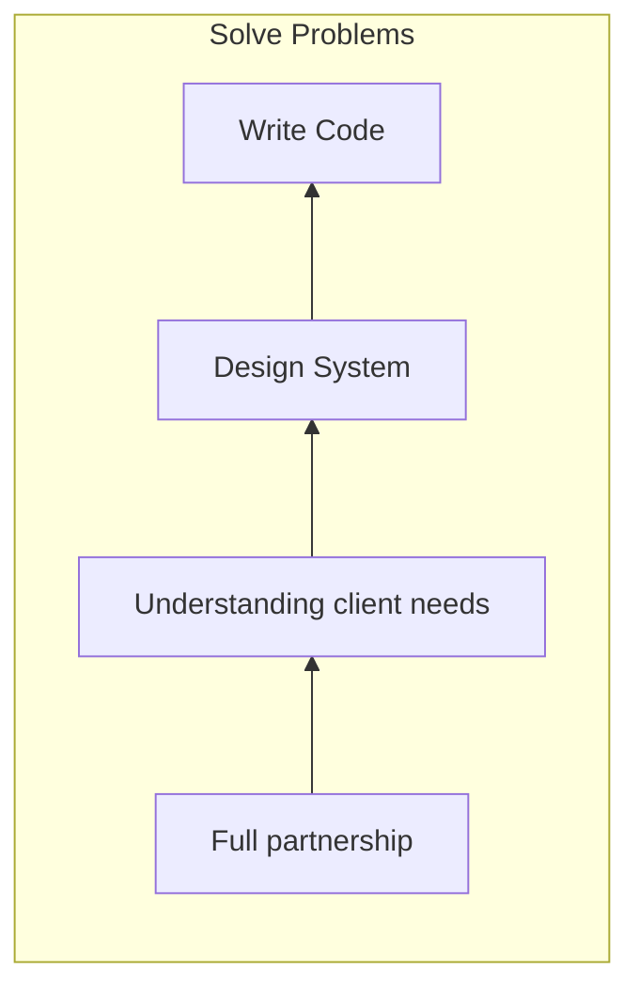

# Introducing Domain-Driven Design

## Why DDD?

Value Proposition of DDD

- Principles and patterns to **solve difficult problems**
- History of **success** with complex projects
- Aligns with practices from developers **experience**
- **Clear, readable, testable code** that represents the domain

## What does a DDD solution look like?

## What is Domain-Driven Design?

Domain-Driven Design is an approach to software development that centers the development on programming a domain model that has a rich understanding of the processes and rules of a domain. The name comes from a 2003 book by Eric Evans that describes the approach through a catalog of patterns. Since then a community of practitioners have further developed the ideas, spawning various other books and training courses. The approach is particularly suited to complex domains, where a lot of often-messy logic needs to be organized.

Eric Evans's great contribution to this, was developing a vocabulary to talk about this approach, identifying key conceptual elements that went beyond the various modeling notations that dominated the discussion at the time. At the heart of this was the idea that to develop software for a complex domain, we need to build Ubiquitous Language that embeds domain terminology into the software systems that we build.

### Gaining a High-Level Understanding of DDD 

- Better Interaction with domain experts
  > You really need to cultivate your ability to communicate with business people to free up people's creative modeling.  
  
  Eric Evans

- Model a **single subdomain** at a time
  - Divide and Conquer - By separating the problem into separate subdomains, we can tackle each problem independently. We are making the problem much easier to solve.
    - Purchase materials - `tasks`, `ubiquitous language`, `unique problems`
    - Engineering - `tasks`, `ubiquitous language`, `unique problems`
    - Manage employees - `tasks`, `ubiquitous language`, `unique problems`
    - Marketing - `tasks`, `ubiquitous language`, `unique problems`
    - Sales - `tasks`, `ubiquitous language`, `unique problems`
  - Modeling - How you decipher and design each subdomain.
- Implementation of subdomains
  - **Separation of Concerns** - plays an important role in implementing subdomains.

## Goals of DDD

- DDD aims to **tackle business complexity**, not technical complexity. 
  > While Domain-Driven Design provides many technical benefits, such as maintainability, it should be applied **only to complex domains** where the model and the linguistic processes **provide clear benefits** in the **communication of complex information**, and in the formulation of a **common understanding of the domain**.

  Eric Evans, Domain-Driven Design

## Benefits and potential drawbacks of DDD

### Benefits of Domain-Driven Design

- Flexible
- Customer’s vision/perspective of the problem
- Path through a very complex problem
- Well-organized and easily tested code
- Business logic lives in one place
- Many great patterns to leverage

### Drawbacks of Domain-Driven Design

- Be Prepared for Time and Effort
  - Discuss and model the problem with domain experts
  - Isolate domain logic from other parts of application
- Be Prepared for a Learning Curve
  - New principles
  - New patterns
  - New processes
- Be Thoughtful About Possible Overuse - DDD is for handling **complexity in business problems**
  - Not just CRUD or data-driven applications.
  - Not just technical complexity without business domain complexity.
- Requires Team and Business Buy-In

## Inspecting a Mind Map of Domain-Driven Design

- Modeling - Modeling is an intense examination of the problem space. 
  - Core Domain - The key is working with the subject matter experts to identify the core domain and other sub-domains that will be tackled.
  - Bounded Contexts - You focus on modeling a particular sub-domain in each of these bounded contexts.
  - Generic Subdomains - The model also has notes for each element, such as avoiding overinvesting in Generic Subdomains. That can be something like the credit card verification service you can use rather than building yourself.

- Software Implementation - As a result of modeling the bounded context, you'll identify entities, value objects, aggregates, domain events, repositories, and more and how they interact with each other.
  - **Entities**
  - **Value Objects**
  - **Domain Events**
  - **Aggregates**
  - **Repositories**

- Communication
  - **Ubiquitous Language** - to come up with terms that will be commonly used when discussing a particular sub-domain. And they most likely are terms coming from problem space, not the software world. They have to be agreed upon so that as discussions move forward, there is clarity and understanding created by the terminology used by team members.

- Development Process
  - **Anti-corruption Layer** - Anti-corruption layer allows sub-domains to communicate with one another from behind their boundaries.
  - Separate Ways - The model also has notes for each element, such as free teams to go separate ways. This is something that can be accomplished once you identify the boundaries of each subdomain.
  

## Exploring the Sample App’s High-Level Structure

