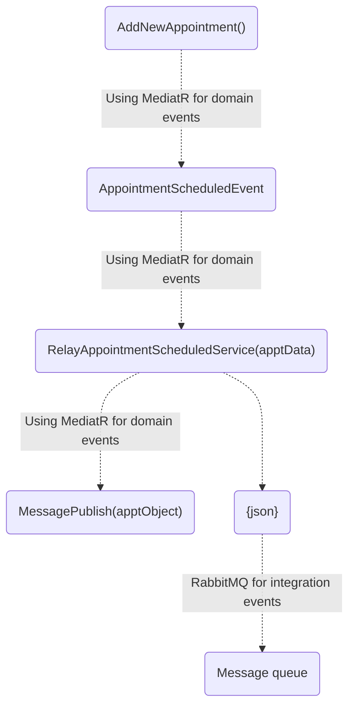

# Message Queues

## Introducing Message Queues

**Message Queues** decuples applications and make it so that one of the applications can drop off something into a **Message Queue** and continue with its work and not have to worry about what happens to the message after that. 

Applications trying to communicate with one another don't need to worry that the other application is available and listening at that very moment. The message can sit in a queue, and when the other application is ready, it does grab it. 

With the **Message Queue**, we were dealing with a single message. One application drops it, another takes it, and then the message is gone.


Sometimes a number of applications are interested in that message, and you might not even know in advance or control those applications. So this is when something called **Service Bus** comes into play. 


**Service Bus** usually sits on top of **Message Queues*, and one of its responsibilities is ensuring that messages get delivered to different applications that care about that messages.

## Sending a Message to the Queue

Appointment Scheduled Workflow



## Reading From the Message Queue and Acting on the Message

`Startup.cs` -  registering `FrontDeskRabbitMqService` as a background service that listens for messages from the RabbitMQ.

```
public void ConfigureServices(IServiceCollection services)
{
    ...

    if (messagingSettings.Enabled)
    {
        services.AddHostedService<FrontDeskRabbitMqService>();
    }
}
```

The `FrontDeskRabbitMqService` periodically checks the message queue to see if anything new has arrived.

```csharp
  protected override Task ExecuteAsync(CancellationToken stoppingToken)
  {
      stoppingToken.ThrowIfCancellationRequested();

      var consumer = new EventingBasicConsumer(_channel);
      consumer.Received += OnMessageReceived;

      _channel.BasicConsume(queue: _queuein,
                    autoAck: true,
                    consumer: consumer);

      return Task.CompletedTask;
  }
```

As soon as a message arrives in a message queue, the `HandleMessage` method is called.

```csharp
private async void OnMessageReceived(object model, BasicDeliverEventArgs args)
{
    var body = args.Body.ToArray();
    var message = Encoding.UTF8.GetString(body);

    await HandleMessage(message);
}
```

The `HandleMessage` method parses the message from the queue and creates `SendAppointmentConfirmationCommand`, which will be published internally by MediatR.

```csharp
private async Task HandleMessage(string message)
{
    _logger.LogInformation($"Handling Message: {message}");
    using var doc = JsonDocument.Parse(message);
    var root = doc.RootElement;
    var eventType = root.GetProperty("EventType");

    using var scope = _serviceScopeFactory.CreateScope();
    var mediator = scope.ServiceProvider.GetRequiredService<IMediator>();

    if(eventType.GetString() == "AppointmentScheduledIntegrationEvent")
    {
        var command = new SendAppointmentConfirmationCommand()
        {
            AppointmentId = root.GetProperty("AppointmentId").GetGuid(),
            AppointmentType = root.GetProperty("AppointmentType").GetString(),
            ClientEmailAddress = root.GetProperty("ClientEmailAddress").GetString(),
            ClientName = root.GetProperty("ClientName").GetString(),
            DoctorName = root.GetProperty("DoctorName").GetString(),
            PatientName = root.GetProperty("PatientName").GetString(),
            AppointmentStartDateTime = root.GetProperty("AppointmentStartDateTime").GetDateTime()
        };
        
        await mediator.Send(command);
    }
    else
    {
        throw new Exception($"Unknown message type: {eventType.GetString()}");
    }
}
```

RabbitMQ will call the `Handle` method in `ConfirmationEmailHandler`, which will call `SendConfirmationEmail` in `ConfirmationEmailSender.cs`.

```csharp
public Task<Unit> Handle(SendAppointmentConfirmationCommand request, 
  CancellationToken cancellationToken)
{
    _logger.LogInformation("Message Received - Sending Email!");

    _emailSender.SendConfirmationEmail(request);

    return Task.FromResult(Unit.Value);
}
```

The `SendConfirmationEmail` method in `ConfirmationEmailSender.cs` sends the mail to the client.

```csharp
  public void SendConfirmationEmail(Models.SendAppointmentConfirmationCommand appointment)
  {
      _logger.LogInformation($"Sending email to confirm appointment: {appointment}");
      string confirmUrl = $"http://localhost:{_config.Port}/appointment/confirm/{appointment.AppointmentId}";
      string to = appointment.ClientEmailAddress;
      string from = "donotreply@thevetclinic.com";
      string subject = "Vet Appointment Confirmation for " + appointment.PatientName;
      string body = string.Format("<html><body>Dear {0},<br/><p>Please click the link below to confirm {1}'s appointment for a {2} with {3} on {4}.</p><p>Thanks!</p><p><a href='{5}'>CONFIRM</a></p><p>Please call the office to reschedule if you will be unable to make it for your appointment.</p><p>Have a great day!</p></body></html>", 
        appointment.ClientName, 
        appointment.PatientName, 
        appointment.AppointmentType, 
        appointment.DoctorName, 
        appointment.AppointmentStartDateTime.ToString(CultureInfo.InvariantCulture), confirmUrl);

      _emailSender.SendEmail(to, from, subject, body);
  }
```
