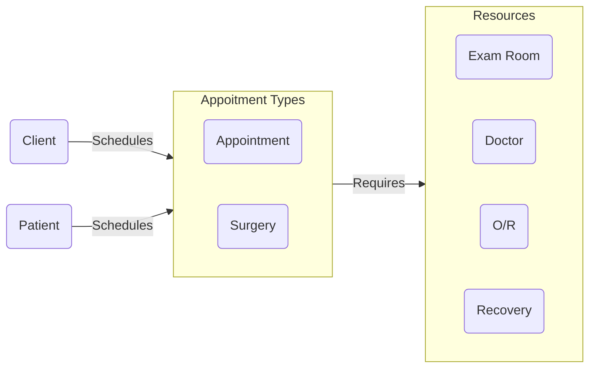

# Modeling Problems in Software

## Domains and Subdomains

**Domain** is the most vital concept of **DDD**, understanding what is **Domain** is essential for us to accomplish what we call ‘Domain Distillation‘.

We can say that **Domain** is a scope where one works and how one works, in other words, it refers to the space of the problem for which we are acting, its **Entities**, its **behavior** and **rules**. Each company owns a unique **Domain**, even if it follows ‘market practices’, the company will always have its own way of doing things, its business differential, its brand.

**One thing we need to know is that the term Domain may have some meanings within the DDD:**

– Domain which is the totality of the Company’s Domain.
– Domain that refers to an area, sector or process of the company.
– Domain that serves as support for the business.

It is from the Domain that we design our Domain Models, which are solutions that seek to meet the needs of the Domain.

## Subdomains

**DDD** requires the decomposition of the **Domain** into **Subdomains**, which facilitates our understanding.

In this way, we are able to separate what in fact generates value and financial return for the company, and thus, strategically we can put our best efforts in that part of the **Domain**.

In simple terms, a **Subdomain** is a subpart of the **Domain**. Regardless of the size of the company, every **Domain** can always be divided into **Subdomains**, by doing this we divide the entire complexity of the Company’s **Domain** into smaller parts, and we will have domain experts who will understand the aspects of the business very well because it is a specific **Subdomain**.

### Types of Subdomains 

- **Core or Basic** - This is where we must put our best efforts, it is what makes the company work, which brings value to the business, which differentiates the company from competitors, is where the greatest focus is placed.
- **Auxiliary or Support** - It is the **Domain** that complements the main **Domain**, without it, its main **Domain** can not be successful, therefore, it is very important, will require internal development or outsourcing, because there is no solution ready to implement.
- **Generic** - It is typically a ready-made solution, but can also be outsourced or even developed internally. It does not bring a specific rule to your main business, ie in most cases we could hire as a service.

## Breaking up the veterinary office domain

### Planning Ahead to Learn About the Domain

Goals for Learning About the Domain
  - Understand client’s business
  - Identify processes beyond project scope
  - Look for subdomains we should include
  - Look for subdomains we can ignore

### Conversation with a Domain Expert: Exploring the Domain and Its Subdomains

Learning about the Complete Domain
  - **Patient scheduling**
  - **Owner and pet data management**
  - Billing (External?)
  - **Surgery scheduling**
  - **Office visit data collection**
  - Sales and Inventory
  - Lab testing (schedule, results, bill)
  - Prescriptions
  - Staff scheduling
  - CMS (External?)  

Some of the Identified Subdomains
  - Staff
  - Accounting
  - Client and patient records
  - Visit records
  - Appointment scheduling
  - Sales
  
### Conversation with a Domain Expert: Exploring the Scheduling Subdomain
  
Continued Deep Collaboration with Domain Experts. Notes from Our Conversations.
  - Clients (people) schedule appointments for patients (pets)
  - Appointments may be either office visits or surgeries
  - Office visits may be an exam requiring a doctor, or a tech visit
  - Office visits depend on exam room availability
  - Surgeries depend on O/R and recovery space availability, and can involve different kinds of procedures
  - Different appointment types and procedures require different staff

> Learn and communicate in the language of the domain, not the language of technology.

### More Questions for a Domain Expert

- Any chance of concurrency conflicts? 
  - Doesn’t anticipate being big enough to have this problem any time soon.
- Do you need to schedule rooms and staff when you schedule an appointment? Dependencies?
  - Room + tech OR…
  - Room + doctor OR…
  - Room + doctor + tech 
- Does “resources” work as an umbrella term for them?
  - Yes!

### Reviewing Key Takeaways from Meeting with Domain Expert(s)

Key Takeaways From the Customer Conversation

-  Patients and clients are not the same thing to a veterinarian.
-  Important to get on the “same page” with the domain expert.
-  The customer gained better understanding of their own business process by describing it in terms we could understand and model.
-  Avoid speaking in programmer terms.
-  At this stage, the focus is on how the domain works, not how the software will work.
-  Make the implicit knowledge of domain experts explicit.

> As software developers, we fail in two ways: We build the thing wrong, or We build the wrong thing.

Steve Smith

### Taking a First Pass at Modeling our Subdomain

The central concept in this application is the **Appointment** itself. Typically the **Appointment** is scheduled by the **Client** for a **Patient**. Often booking an **Appointment** requires an **Exam Room** and a **Doctor**, but it may involve other resources.

**Appointments** may be for office visits or vaccinations, or they may be **Surgeries** which are separate kinds of things entirely with their own rules. They involve different kinds of **Procedures**. **Surgeries** require different **Resources**, too, like **Operating Room** and **Recovery Room**.

## Using Bounded Contexts to Untangle Concepts that Appear to Be Shared

As you develop your **Model**, remember to identify its **Bounded Context** - **where this Model is valid**. If you do not put boundaries around your **Model**, pieces of it will eventually be used where they don't fit. Concepts that make sense in one part of your application may not make sense in another.

- Define a strong boundary around the concepts of each model.
- Ensure model’s concepts don’t leak into other models where they don’t make sense.

> Explicitly define the context within which a model applies… Keep the model strictly consistent within these bounds, but don’t be distracted or confused by issues outside.

Eric Evans

- **Subdomain** - is a problem space concept.
- **Bounded Context** - is a solution space concept.

Bounded Context is a central pattern in Domain-Driven Design. It is the focus of DDD's strategic design section which is all about dealing with large models and teams. DDD deals with large models by dividing them into different Bounded Contexts and being explicit about their interrelationships.

DDD is about designing software based on models of the underlying domain. A model acts as a UbiquitousLanguage to help communication between software developers and domain experts. It also acts as the conceptual foundation for the design of the software itself - how it's broken down into objects or functions. To be effective, a model needs to be unified - that is to be internally consistent so that there are no contradictions within it.

Bounded Contexts have both unrelated concepts (such as a support ticket only existing in a customer support context) but also share concepts (such as products and customers). Different contexts may have completely different models of common concepts with mechanisms to map between these polysemic concepts for integration. Several DDD patterns explore alternative relationships between contexts.

Various factors draw boundaries between contexts. Usually the dominant one is human culture, since models act as Ubiquitous Language, you need a different model when the language changes. You also find multiple contexts within the same domain context, such as the separation between in-memory and relational database models in a single application. This boundary is set by the different way we represent models.

DDD's strategic design goes on to describe a variety of ways that you have relationships between Bounded Contexts. It's usually worthwhile to depict these using a context map.

## Introducing Context Maps

**Context Map** - Demonstrates how bounded contexts connect to one another while supporting communication between teams.

## Addressing the Question of Separate Databases per Bounded Context

> If you’re in a company where you share your database and it gets updated by hundreds of different processes, it's very hard to create the kind of models that we're talking about and then write software that does anything interesting with those models.

Eric Evans

## Specifying Bounded Contexts in our Application

> It’s not a simple task, even with experience. Lack of clear boundary impedes the application of DDD ideas. Bounded context is an essential ingredient. Defining boundaries is the biggest stumbling block.

Eric Evans

## Understanding the Ubiquitous Language of a Bounded Context

The language we use is key to the shared understanding we want to have with our domain experts in order to be successful. A ubiquitous language applies to a
single bounded context and is used throughout conversations and code for that context.

- Try to explain back to the customer what you think they explained to you.
- Avoid: "What I meant was…"

> A project faces serious problems when its language is fractured.

Eric Evans

Ubiquitous Language is the term Eric Evans uses in Domain Driven Design for the practice of building up a common, rigorous language between developers and users. This language should be based on the Domain Model used in the software - hence the need for it to be rigorous, since software doesn't cope well with ambiguity.

Evans makes clear that using the ubiquitous language in conversations with domain experts is an important part of testing it, and hence the domain model. He also stresses that the language (and model) should evolve as the team's understanding of the domain grows.

> By using the model-based language pervasively and not being satisfied until it flows, we approach a model that is complete and comprehensible, made up of simple elements that combine to express complex ideas.
>
> ...
>
>  Domain experts should object to terms or structures that are awkward or inadequate to convey domain understanding; developers should watch for ambiguity or inconsistency that will trip up design.

Eric Evans

### Conversation with a Domain Expert: Working on our Ubiquitous Language

> Recognize that a change in the ubiquitous language is a change in the model.

Eric Evans

### More Thoughts About the Ubiquitous Language

The ubiquitous language of a bounded context is ubiquitous throughout everything you do in that context – discuss, model, code, etc.

- Terms can seem overwhelming at first
- But they are important to ensure a common understanding of the process
- The terms are almost “the ubiquitous language” of DDD
- Easier to convey meaning

In code, namespaces are helpful to quickly identify which bounded context you’re working in.

## Reviewing Important Concepts from This Module

- Problem Domain - The specific problem the software you’re working on is trying to solve.
- Core Domain - The key differentiator for the customer’s business -- something they must do well and cannot outsource.
- Subdomains - Separate applications or features your software must support or interact with.
- Bounded Context - A specific responsibility, with explicit boundaries that separate it from other parts of the system.
- Context Mapping - The process of identifying bounded contexts and their relationships to one another.
- Shared Kernel - Part of the model that is shared by two or more teams, who agree not to change it without collaboration.
- Ubiquitous Language - The language using terms from a domain model that programmers and domain experts use to discuss that particular sub-system.

