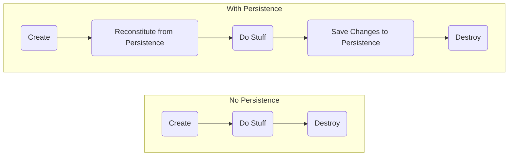

# Working with Repositories

## [Introducing Repositories](/06.%20Repositories)

Random data access code in your system makes it difficult to maintain the integrity of your models.


Having ad hoc access to the data source also promotes having developers query for any bit of data they want at any time they want instead of using **Aggregates**. This makes it challenging to manage the consistency of **Aggregates** by inforcing their **Invariants**. At best, the logic for enforcing the integrity of the **Model** becomes scattered among many queries. And, at worst, it's not done at all.

Applying separation of concerns means pushing persistent behavior into its own set of abstractions which we referred to as **Repositories**. Only particular objects, specifically **Aggregate Roots**, should be available over global requests. **Repositories** provide this access and, through omission, prevent access to non-aggregate objects except through their **Aggregate Roots**.

Object Life Cycles



Use a repository to manage the life cycle of persisted objects. Without the objects had to know anything about their persistence. We call these objects **Persistence Ignorant** because they are ignorant about how they are stored in or retrieved from a data store.

**Persistence Ignorance** - Business objects have no logic related to how data is stored and retrieved.

> A repository represents all objects of a certain type as a conceptual set… like a collection with more elaborate querying capability.

Eric Evans


## Repository Benefits

- Provides common abstraction for persistence.
- Promotes separation of concerns.
- Communicates design decisions.
- Enables testability.
- Improved maintainability.


## Repository Tips

- Think of it as an in-memory collection.
- Implement a known, common access Interface. Example:
    ```csharp
    public interface IRepository<T>
    {
        T GetById(int id);
        void Add(T entity);
        void Remove(T entity);
        void Update(T entity);
        IEnumerable<T> List();
    }
    ```
    
- Include methods to add and remove. Example:
    ```csharp
    public void Insert(TEntity entity)
    {
        _dbSet.Add(entity);
        _context.SaveChanges();
    }
    
    public void Delete(int id)
    {
        var entityToDelete = _dbSet.Find(id);
        _dbSet.Remove(entityToDelete);
        _context.SaveChanges();
    }
    ```
    
- Custom Query Implementation using EF Core.
    - Get a **Schedule** instance with all the **Appointments** for a given date.
    
    ```csharp
    public Schedule GetScheduleForDateWithAppointments(
        int clinicId,
        DateTimeOffset date)
    {
        var endDate = date.AddDays(1);
        var schedule = _dbContext.Set<Schedule>()
            .Include(s => s.Appointments.Where( a =>
                a.TimeRange.Start > date &&
                a.TimeRange.End < endDate))
            .FirstOrDefault(schedule =>
                schedule.ClinicId == clinicId);

        return schedule;
    }
    ```
    - Get a Client with their Patients
    
    ```csharp
    public Client GetClientByIdWithPatients(int clientId)
    {
        var client = _dbContext.Set<Client>()
            .Include(c => c.Patients)
            .FirstOrDefault(client => client.Id == clientId);

        return client;
    }
    ```
    
Be careful of **Custom Query Implementation** as it can grow out of hand, and your repositories may end with many different query methods. A simple way to address this is to use [specification](/07.%20Specification) instead.
