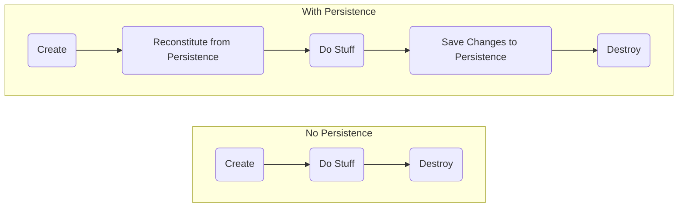
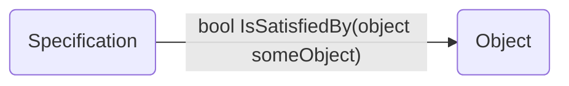
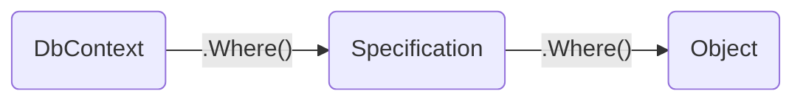

# Working with Repositories

## [Introducing Repositories](/06.%20Repositories)

Random data access code in your system makes it difficult to maintain the integrity of your models.

Having ad hoc access to the data source also promotes having developers query for any bit of data they want at any time they want instead of using **Aggregates**. This makes it challenging to manage the consistency of **Aggregates** by inforcing their **Invariants**. At best, the logic for enforcing the integrity of the **Model** becomes scattered among many queries. And, at worst, it's not done at all.

Applying separation of concerns means pushing persistent behavior into its own set of abstractions which we referred to as **Repositories**. Only particular objects, specifically **Aggregate Roots**, should be available over global requests. **Repositories** provide this access and, through omission, prevent access to non-aggregate objects except through their **Aggregate Roots**.

Object Life Cycles



Use a repository to manage the life cycle of persisted objects. Without the objects had to know anything about their persistence. We call these objects **Persistence Ignorant** because they are ignorant about how they are stored in or retrieved from a data store.

**Persistence Ignorance** - Business objects have no logic related to how data is stored and retrieved.

> A repository represents all objects of a certain type as a conceptual set… like a collection with more elaborate querying capability.

Eric Evans


## Repository Benefits

- Provides common abstraction for persistence.
- Promotes separation of concerns.
- Communicates design decisions.
- Enables testability.
- Improved maintainability.


## Repository Tips

- Think of it as an in-memory collection.
- Implement a known, common access Interface. Example:
    ```csharp
    public interface IRepository<T>
    {
        T GetById(int id);
        void Add(T entity);
        void Remove(T entity);
        void Update(T entity);
        IEnumerable<T> List();
    }
    ```
    
- Include methods to add and remove. Example:
    ```csharp
    public void Insert(TEntity entity)
    {
        _dbSet.Add(entity);
        _context.SaveChanges();
    }
    
    public void Delete(int id)
    {
        var entityToDelete = _dbSet.Find(id);
        _dbSet.Remove(entityToDelete);
        _context.SaveChanges();
    }
    ```
    
- Custom Query Implementation using EF Core.
    - Get a **Schedule** instance with all the **Appointments** for a given date.
    
    ```csharp
    public Schedule GetScheduleForDateWithAppointments(
        int clinicId,
        DateTimeOffset date)
    {
        var endDate = date.AddDays(1);
        var schedule = _dbContext.Set<Schedule>()
            .Include(s => s.Appointments.Where( a =>
                a.TimeRange.Start > date &&
                a.TimeRange.End < endDate))
            .FirstOrDefault(schedule =>
                schedule.ClinicId == clinicId);

        return schedule;
    }
    ```
    - Get a Client with their Patients
    
    ```csharp
    public Client GetClientByIdWithPatients(int clientId)
    {
        var client = _dbContext.Set<Client>()
            .Include(c => c.Patients)
            .FirstOrDefault(client => client.Id == clientId);

        return client;
    }
    ```
    
Be careful of **Custom Query Implementation** as it can grow out of hand, and your repositories may end with many different query methods. A simple way to address this is to use [specification](/07.%20Specification) instead.

- Use repositories for aggregate roots only.
- Client focuses on model, repository on persistence.

## Avoiding Repository Blunders

Client code can be ignorant of repository implementation **…but developers cannot**.

- N+1 Query Errors - To display a list of rows from a database, you call one query to get a list and then a number of queries equal to the count of that list to fetch each item individually.

<table>
<tr>
<td> Code </td> 
<td> Result </td>
</tr>
<tr>
<td>
    
```csharp
    var clients = _context.Clients.ToList();

    foreach (var client in clients)
    {
        _context.Patients
            .Where(p => p.ClientId == client.Id)
            .ToList();
    }
``` 

</td>
<td>

```
    select Clients.* from Clients
    
    select Patients.* from Patients where ClientId=1
    select Patients.* from Patients where ClientId=2
    select Patients.* from Patients where ClientId=3
    select Patients.* from Patients where ClientId=4
    select Patients.* from Patients where ClientId=5
    select Patients.* from Patients where ClientId=6
    select Patients.* from Patients where ClientId=7
    select Patients.* from Patients where ClientId=8
    select Patients.* from Patients where ClientId=9
    select Patients.* from Patients where ClientId=10
```

</td>
</tr>

</table>

- Inappropriate use of eager or lazy loading.
- Fetching more data than required.

Most of these blunders impact how data is accessed in a data store, meaning that one of the best tools you have for surfacing these problems is profiling your data store.


## Using Repositories

Repository - An abstraction your **Domain Model** uses to define what persistence needs it has. They are part of your **Domain Model**. They define the persistence operations the **Model** will use. 

A domain model should be persistent and ignorant as well as ignorant of implementation details. Using SOLID in DDD enables us to follow **Dependency Inversion**. We can define an abstraction in the **Domain Model** and then implement that abstraction in another project that depends on the domain model.


## Returning IQueryables: Pros and Cons

### Returning IQueryable from Repository List methods


| Pros                                            	| Cons                                          	|
|-----------------------------------------------	|--------------------------------------------------	|
| Flexibility                                   	| Query logic spread out everywhere                	|
| Can build query from multiple locations       	| Violating Single Responsibility Principle        	|
| Minimal Repository code required              	| Violating Separation of Concerns                 	|
| Restrict data returned to just what is needed 	| Confusion about when the query actually executes 	|
| Reuse small set of Repository methods         	| Code compiles, but blows up when executed        	|
|                                               	| No encapsulation                                 	|

### Accept Arbitrary Predicates - instead of returning IQueryable from Repository List methods

Predicate - Expression used in the search condition of a query’s where clause. Represents the method that defines a set of criteria and determines whether the specified object meets those criteria.

```csharp
public interface ICustomerRepository
{
    IEnumerable<Customer> List(Expression<Func<Customer,bool>> predicate);
}

public IEnumerable<Customer> List(Expression<Func<Customer,bool>> predicate)
{
    return _db.Customers.Where(predicate);
}
```

It helps with part of the problem where the query could be executed at any of these points. At least now we know that whatever comes back from the **Repository** will be in memory result. The actual query is always executed at **Repository** itself.


Of course, if the **Service** takes in a predicate, it still means that any code anywhere in this system could be responsible for creating the query logic. With the possible exception of the **View** if it has just been passed **IEnumerable** at this point.


| Pros                                            	| Cons                                          	    |
|-----------------------------------------------	|-------------------------------------------------------|
| Flexibility                                   	| Query logic spread out everywhere                	    |
| ~~Can build query from multiple locations~~      	| Violating Single Responsibility Principle        	    |
| Minimal Repository code required              	| Violating Separation of Concerns                 	    |
| Restrict data returned to just what is needed 	| ~~Confusion about when the query actually executes~~  |
| Reuse small set of Repository methods         	| Code compiles, but blows up when executed        	    |
|                                               	| No encapsulation                                 	    |


### Custom Query Methods

```csharp
public interface ICustomerReadRepository
{
    Customer GetById(int id);
    List<Customer> List();
    // custom queries
    List<Customer> ListCustomersByState(string state);
    List<Customer> ListCustomersBySales(decimal minSales);
    List<Customer> ListCustomersWithOrders();
    List<Customer> ListCustomersWithAddresses();
    List<Customer> ListCustomersWithOrdersAndAddresses();
    List<Customer> ListCustomersByStateWithOrders(string state);
    List<Customer> ListCustomersByLastName(string lastName);
    List<Customer> ListCustomersByGeo(int latitude, int longitude, int radiusMiles);
    List<Customer> ListCustomersByShoeSize(string size);
    List<Customer> ListCustomersByFavoriteNetflixShow(string title);
    // and more get added all the time
}
```

## Generic Repository Benefits

- Promote code-reuse - With a straightforward interface, any **Entity** can be persistent using a standard set of operations.
- Promote code-reuse protect aggregates - Generic constraints can ensure that only **Aggregate Roots** can be persisted using your interface.

`IRepository` May Lead to Unused Methods

<table>
    
<tr>
<td> Interface for Any Repository </td> 
<td> Implementing IRepository </td>
</tr>
    
<tr>
<td>
    
```csharp
public interface IRepository<T>
{
	T GetById(int id);
	void Add(T entity);
	void Remove(T entity);
	void Update(T entity);
	IEnumerable<T> List();
}
```
    
</td>
<td>
    
```csharp
    class ScheduleRepo : IRepository<Schedule>
    {
        public Schedule GetById(int id)
        { ...some logic... }
        public void Add(Schedule entity)
        {...some logic... }
        public void Remove(Schedule entity)
        { ... Do nothing! ... }
        public void Update(Schedule entity)
        { ...some logic... }
        public void IEnumerable<Schedule> List
        {}
    }
```
    
</td>
</tr>
	
<tr>
<td colspan="2">
<p align="center">
    A Targeted <b>IScheduleRepository</b> with Relevant Methods
</p>
</td>
</tr>
    
<tr>
<td colspan="2">
    
```csharp
public interface IScheduleRepository
{
    Schedule GetScheduleForDateWithAppointments(int clinicId, DateTime date);
    void Update(Schedule schedule);
}
```
    
</td>
</tr>
    
<tr>
<td colspan="2">
<p align="center">
    Generic Repositories for Aggregate Roots
</p>
</td>
</tr>
      
<tr>
<td>
    
```csharp
public class Root : IEntity
{
    public int Id { get; init; }
    ...
}
```

</td>
<td>
    
```csharp
public class RootRepository : IRepository<Root>
{
    public IEnumerable<Root> List() {}
    public Root GetById(int id) {}
    public void Insert (Root entity) {}
    public void Update (Root entity) {}
    public void Delete (Root etity) {}
}
```

</td>
</tr>
	
<tr>
<td colspan="2">
<p align="center">
    Marker interfaces can provide protection to your aggregates
</p>
</td>
</tr>
	
<tr>
<td colspan="2">

```csharp
public interface IAggregateRoot : IEntity {}
	
public class Root : IAggregateRoot
{
    public int Id { get; init; }
}
	
public class Repository<TEntity> : IRepository<TEntity>
   where TEntity : class, IAggregateRoot	
{}
```
	
<tr>
<td colspan="2">
<p align="center">
    Generic Repositories for CRUD Work
</p>
</td>
</tr>
	
<tr>
<td colspan="2">

```csharp
public class Repository<TEntity> : IRepository<TEntity>
{
	private readonly CrudContext _context;
	private readonly DbSet<TEntity> _dbSet;
	
	public Repository(CrudContext context) {}
	public IEnumerable<TEntity> List() {}
	public Root GetById(int id) {}
	public void Insert (TEntity entity) {}
	public void Update (TEntity entity) {}
	public void Delete (TEntity etity) {}
}	
```
	
</td>
</tr>

</table>
    
Trade-Offs
- Consistent persistence implementation, but possible unused methods.
- Individually crafted classes with a variety of bespoke methods.
    

## Introducing the [Specification](/07.%20Specification) Pattern

> Specifications mesh smoothly with Repositories, which are the building-block mechanisms for providing query access to domain objects and encapsulating the interface to the database.
	
Eric Evans
	


**Specifications** are used to specify the state of an object. And as such are primarily used in three ways.
- Validation
- Selection & Querying
- Creation for a specific purpose
	
> Create explicit predicate-like **Value Objects** for specialized purposes. A Specification is a predicate that determines if an object satisfies some criteria.
	
Eric Evans

### A Basic Specification
	
The most basic **Specification** provides a method typically named `IsSatisfiedBy`, which accepts some `object`, and returns a `bool`. These methods performed their logic in memory. Unfortunately, in remote data querying scenarios, this approach would require every row to be transferred to the application before the specification logic could be executed against it.
	

	
### Combining Specifications with ORMs
	
**Specifications** can be used with ORMs (ex., EF) to encapsulate the details of a query while still allowing an ORM to translate the query to SQL that executes on a database server.
	

	
One of the benefits of using a **Repository** was preventing query logic from spreading throughout the application. This was also the reason for not returning the `IQueryable` from the **Repository** method. The same reasoning can be applied to **Repositories** that accept arbitrary predicates. Sense again that means the complexity of these predicates would mean to live in code calling the **Repository**, which may be in UI Layer, for example.
	
Using **Repository** interfaces that accept **Specifications** instead of custom predicates addresses this problem very elegantly.


### Typed Repository Interfaces Provide Needed Query Methods

Generic methods accepting generic **Specifications** allow for custom queries where needed for any given **Aggregate**.
	
```csharp
public interface ICustomerReadRepository
{
	Customer GetById(int id);
	List<Customer> List();
	List<Customer> ListCustomersBySpecification(specification);
}
```

### Specification Benefits
	
- Named Classes via **Ubiquitous Language**.
- Reusable.
- Separate Persistence from Domain Model and UI.
- Keep Business Logic out of Persistence Layer and Database.
- Help **Entities** & **Aggregates** follow Single Responsibility Principle (SRP).
	
	
## [Ardalis Specification](https://github.com/ardalis/Specification) Base Class
	
```csharp
    public abstract class Specification<T> : ISpecification<T>
    {
        protected IInMemorySpecificationEvaluator Evaluator { get; }
        protected virtual ISpecificationBuilder<T> Query { get; }

        protected Specification()
            : this(InMemorySpecificationEvaluator.Default)
        {
        }

        protected Specification(IInMemorySpecificationEvaluator inMemorySpecificationEvaluator)
        {
            this.Evaluator = inMemorySpecificationEvaluator;
            this.Query = new SpecificationBuilder<T>(this);
        }

        public virtual IEnumerable<T> Evaluate(IEnumerable<T> entities)
        {
            return Evaluator.Evaluate(entities, this);
        }

        public IEnumerable<Expression<Func<T, bool>>> WhereExpressions { get; } = new List<Expression<Func<T, bool>>>();

        public IEnumerable<(Expression<Func<T, object>> KeySelector, OrderTypeEnum OrderType)> OrderExpressions { get; } = 
            new List<(Expression<Func<T, object>> KeySelector, OrderTypeEnum OrderType)>();

        public IEnumerable<IncludeExpressionInfo> IncludeExpressions { get; } = new List<IncludeExpressionInfo>();

        public IEnumerable<string> IncludeStrings { get; } = new List<string>();

        public IEnumerable<(Expression<Func<T, string>> Selector, string SearchTerm, int SearchGroup)> SearchCriterias { get; } =
            new List<(Expression<Func<T, string>> Selector, string SearchTerm, int SearchGroup)>();

        public int? Take { get; internal set; } = null;

        public int? Skip { get; internal set; } = null;

        public bool IsPagingEnabled { get; internal set; } = false;

        public Func<IEnumerable<T>, IEnumerable<T>>? PostProcessingAction { get; internal set; } = null;

        public string? CacheKey { get; internal set; }

	public bool CacheEnabled { get; internal set; }

        public bool AsNoTracking { get; internal set; } = false;
	
        public bool AsSplitQuery { get; internal set; } = false;
	
        public bool AsNoTrackingWithIdentityResolution { get; internal set; } = false;
    }
	
    public abstract class Specification<T, TResult> : Specification<T>, ISpecification<T, TResult>
    {
        protected new virtual ISpecificationBuilder<T, TResult> Query { get; }

        protected Specification()
            : this(InMemorySpecificationEvaluator.Default)
        {
        }

        protected Specification(IInMemorySpecificationEvaluator inMemorySpecificationEvaluator)
            : base(inMemorySpecificationEvaluator)
        {
            this.Query = new SpecificationBuilder<T, TResult>(this);
        }

        public new virtual IEnumerable<TResult> Evaluate(IEnumerable<T> entities)
        {
            return Evaluator.Evaluate(entities, this);
        }

        public Expression<Func<T, TResult>>? Selector { get; internal set; }

        public new Func<IEnumerable<TResult>, IEnumerable<TResult>>? PostProcessingAction { get; internal set; } = null;
    }
```
	
## Implementing Specification Classes
	
- You will need to write the rules of your specifications.
- The classes belong in your domain model.
- If only a few, organize in root Specifications folder.
- Or, along side your aggregates in their folders.
	
Custom Specification Inheriting from Base:
	
Each **Specifications** class is a value object. So it should be immutable. Generally, they do all of their work in the constructor. Any variable part of the **Specifications** should be supplied as a constructor argument. 
	
```csharp
public class ScheduleIdWithAppointmentsSpec : Specification<Schedule>
{
    public ScheduleByIdWithAppointmentsSpec(Guid scheduleId)
    {
        Query
	    .Where(schedule => schedule.Id == scheduleId)
	    .Include(schedule => schedule.Appointments);
    }
}
```
	
Examples of Applying Specifications in EF Core: 
	
Once constructed, the **Specification** needs to be supplied to your query implementation. You can use **Specifications** directly with the EF or the **Repository** abstraction that supports them. In either case, pass the **Specification** to the query object, and it will be used to build the query. Which is the executed and results are returned.
	
```csharp
dbContext.Customers.WithSpecification(specification).ToListAsync();
	
dbContext.Customers.WithSpecification(specification).FirstOrDefaultAsync();
	
dbContext.Customers.WithSpecification(specification)
    .Select("whatever your expression is").ToListAsync();
	
dbContext.Customers.WithSpecification(specification)
    .UseWhateverExtensionsAvailableForIQueryable;
```
	
Using Specifications in Your Code:
	
The resulting code for most queries turns into one line to create the **Specification** and another line to execute the query by passing **Specification** to a **Repository** or a **DbContext** method.
	
```csharp
var clientSpec = new ClientByIdIncludePatientsSpecification(appointment.ClientId);
var client = await _clientRepository.GetBySpecAsync(clientSpec);
```

## Key Terms from this Module
	
**Repository** - A class that encapsulates the data persistence for an aggregate root.
**Specification Pattern** - A method of encapsulating a business rule so that it can be passed to other methods which are responsible for applying it.
**Persistence Ignorance** - Objects are unaware of where their data comes from or goes to.
**ACID** - Atomic, Consistent, Isolated, and Durable.	
	
	
