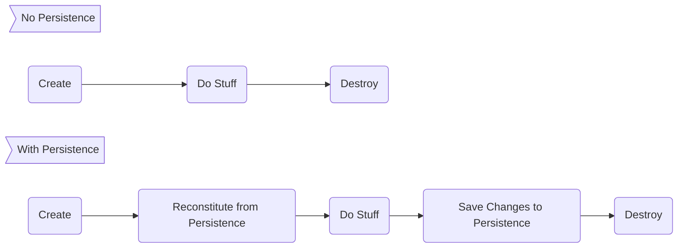

# Working with Repositories

## [Introducing Repositories](/06.%20Repositories)

Random data access code in your system makes it difficult to maintain the integrity of your models.

Having ad hoc access to the data source also promotes having developers query for any bit of data they want at any time they want instead of using **Aggregates**. This makes it challenging to manage the consistency of **Aggregates** by inforcing their **Invariants**. At best, the logic for enforcing the integrity of the **Model** becomes scattered among many queries. And, at worst, it's not done at all.

Applying separation of concerns means pushing persistent behavior into its own set of abstractions which we referred to as **Repositories**. Only particular objects, specifically **Aggregate Roots**, should be available over global requests. **Repositories** provide this access and, through omission, prevent access to non-aggregate objects except through their **Aggregate Roots**.

Object Life Cycles

