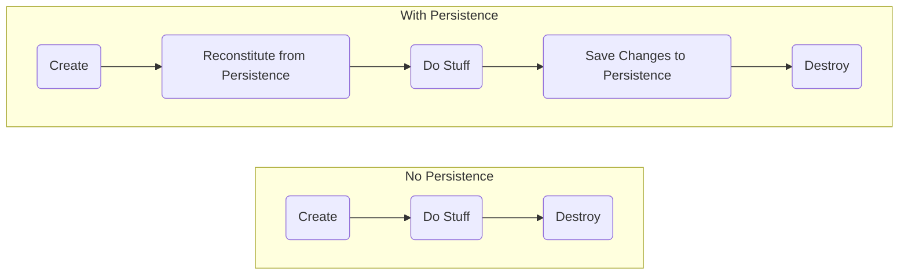

# Working with Repositories

## [Introducing Repositories](/06.%20Repositories)

Random data access code in your system makes it difficult to maintain the integrity of your models.


Having ad hoc access to the data source also promotes having developers query for any bit of data they want at any time they want instead of using **Aggregates**. This makes it challenging to manage the consistency of **Aggregates** by inforcing their **Invariants**. At best, the logic for enforcing the integrity of the **Model** becomes scattered among many queries. And, at worst, it's not done at all.

Applying separation of concerns means pushing persistent behavior into its own set of abstractions which we referred to as **Repositories**. Only particular objects, specifically **Aggregate Roots**, should be available over global requests. **Repositories** provide this access and, through omission, prevent access to non-aggregate objects except through their **Aggregate Roots**.

Object Life Cycles



Use a repository to manage the life cycle of persisted objects. Without the objects had to know anything about their persistence. We call these objects **Persistence Ignorant** because they are ignorant about how they are stored in or retrieved from a data store.

**Persistence Ignorance** - Business objects have no logic related to how data is stored and retrieved.

> A repository represents all objects of a certain type as a conceptual set… like a collection with more elaborate querying capability.

Eric Evans


## Repository Benefits

- Provides common abstraction for persistence.
- Promotes separation of concerns.
- Communicates design decisions.
- Enables testability.
- Improved maintainability.


## Repository Tips

- Think of it as an in-memory collection.
- Implement a known, common access Interface. Example:
    ```csharp
    public interface IRepository<T>
    {
        T GetById(int id);
        void Add(T entity);
        void Remove(T entity);
        void Update(T entity);
        IEnumerable<T> List();
    }
    ```
    
- Include methods to add and remove. Example:
    ```csharp
    public void Insert(TEntity entity)
    {
        _dbSet.Add(entity);
        _context.SaveChanges();
    }
    
    public void Delete(int id)
    {
        var entityToDelete = _dbSet.Find(id);
        _dbSet.Remove(entityToDelete);
        _context.SaveChanges();
    }
    ```
    
- Custom Query Implementation using EF Core.
    - Get a **Schedule** instance with all the **Appointments** for a given date.
    
    ```csharp
    public Schedule GetScheduleForDateWithAppointments(
        int clinicId,
        DateTimeOffset date)
    {
        var endDate = date.AddDays(1);
        var schedule = _dbContext.Set<Schedule>()
            .Include(s => s.Appointments.Where( a =>
                a.TimeRange.Start > date &&
                a.TimeRange.End < endDate))
            .FirstOrDefault(schedule =>
                schedule.ClinicId == clinicId);

        return schedule;
    }
    ```
    - Get a Client with their Patients
    
    ```csharp
    public Client GetClientByIdWithPatients(int clientId)
    {
        var client = _dbContext.Set<Client>()
            .Include(c => c.Patients)
            .FirstOrDefault(client => client.Id == clientId);

        return client;
    }
    ```
    
Be careful of **Custom Query Implementation** as it can grow out of hand, and your repositories may end with many different query methods. A simple way to address this is to use [specification](/07.%20Specification) instead.

- Use repositories for aggregate roots only.
- Client focuses on model, repository on persistence.

## Avoiding Repository Blunders

Client code can be ignorant of repository implementation **…but developers cannot**.

- N+1 Query Errors - To display a list of rows from a database, you call one query to get a list and then a number of queries equal to the count of that list to fetch each item individually.

<table>
<tr>
<td> Code </td> 
<td> Result </td>
</tr>
<tr>
<td>
    
```csharp
    var clients = _context.Clients.ToList();

    foreach (var client in clients)
    {
        _context.Patients
            .Where(p => p.ClientId == client.Id)
            .ToList();
    }
``` 

</td>
<td>

```
    select Clients.* from Clients
    
    select Patients.* from Patients where ClientId=1
    select Patients.* from Patients where ClientId=2
    select Patients.* from Patients where ClientId=3
    select Patients.* from Patients where ClientId=4
    select Patients.* from Patients where ClientId=5
    select Patients.* from Patients where ClientId=6
    select Patients.* from Patients where ClientId=7
    select Patients.* from Patients where ClientId=8
    select Patients.* from Patients where ClientId=9
    select Patients.* from Patients where ClientId=10
```

</td>
</tr>

</table>

- Inappropriate use of eager or lazy loading.
- Fetching more data than required.

Most of these blunders impact how data is accessed in a data store, meaning that one of the best tools you have for surfacing these problems is profiling your data store.


## Using Repositories

Repository - An abstraction your **Domain Model** uses to define what persistence needs it has. They are part of your **Domain Model**. They define the persistence operations the **Model** will use. 

A domain model should be persistent and ignorant as well as ignorant of implementation details. Using SOLID in DDD enables us to follow **Dependency Inversion**. We can define an abstraction in the **Domain Model** and then implement that abstraction in another project that depends on the domain model.


## Returning IQueryables: Pros and Cons

### Returning IQueryable from Repository List methods


| Pros                                            	| Cons                                          	|
|-----------------------------------------------	|--------------------------------------------------	|
| Flexibility                                   	| Query logic spread out everywhere                	|
| Can build query from multiple locations       	| Violating Single Responsibility Principle        	|
| Minimal Repository code required              	| Violating Separation of Concerns                 	|
| Restrict data returned to just what is needed 	| Confusion about when the query actually executes 	|
| Reuse small set of Repository methods         	| Code compiles, but blows up when executed        	|
|                                               	| No encapsulation                                 	|

### Accept Arbitrary Predicates - instead of returning IQueryable from Repository List methods

Predicate - Expression used in the search condition of a query’s where clause. Represents the method that defines a set of criteria and determines whether the specified object meets those criteria.

```csharp
public interface ICustomerRepository
{
    IEnumerable<Customer> List(Expression<Func<Customer,bool>> predicate);
}

public IEnumerable<Customer> List(Expression<Func<Customer,bool>> predicate)
{
    return _db.Customers.Where(predicate);
}
```

It helps with part of the problem where the query could be executed at any of these points. At least now we know that whatever comes back from the **Repository** will be in memory result. The actual query is always executed at **Repository** itself.


Of course, if the **Service** takes in a predicate, it still means that any code anywhere in this system could be responsible for creating the query logic. With the possible exception of the **View** if it has just been passed **IEnumerable** at this point.


| Pros                                            	| Cons                                          	    |
|-----------------------------------------------	|-------------------------------------------------------|
| Flexibility                                   	| Query logic spread out everywhere                	    |
| ~~Can build query from multiple locations~~      	| Violating Single Responsibility Principle        	    |
| Minimal Repository code required              	| Violating Separation of Concerns                 	    |
| Restrict data returned to just what is needed 	| ~~Confusion about when the query actually executes~~  |
| Reuse small set of Repository methods         	| Code compiles, but blows up when executed        	    |
|                                               	| No encapsulation                                 	    |


### Custom Query Methods

```csharp
public interface ICustomerReadRepository
{
    Customer GetById(int id);
    List<Customer> List();
    // custom queries
    List<Customer> ListCustomersByState(string state);
    List<Customer> ListCustomersBySales(decimal minSales);
    List<Customer> ListCustomersWithOrders();
    List<Customer> ListCustomersWithAddresses();
    List<Customer> ListCustomersWithOrdersAndAddresses();
    List<Customer> ListCustomersByStateWithOrders(string state);
    List<Customer> ListCustomersByLastName(string lastName);
    List<Customer> ListCustomersByGeo(int latitude, int longitude, int radiusMiles);
    List<Customer> ListCustomersByShoeSize(string size);
    List<Customer> ListCustomersByFavoriteNetflixShow(string title);
    // and more get added all the time
}
```
